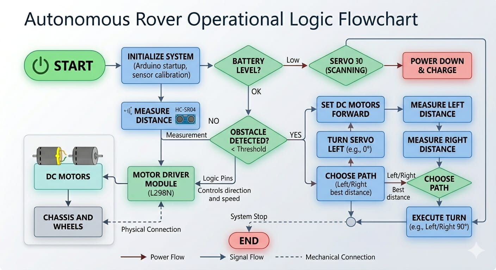
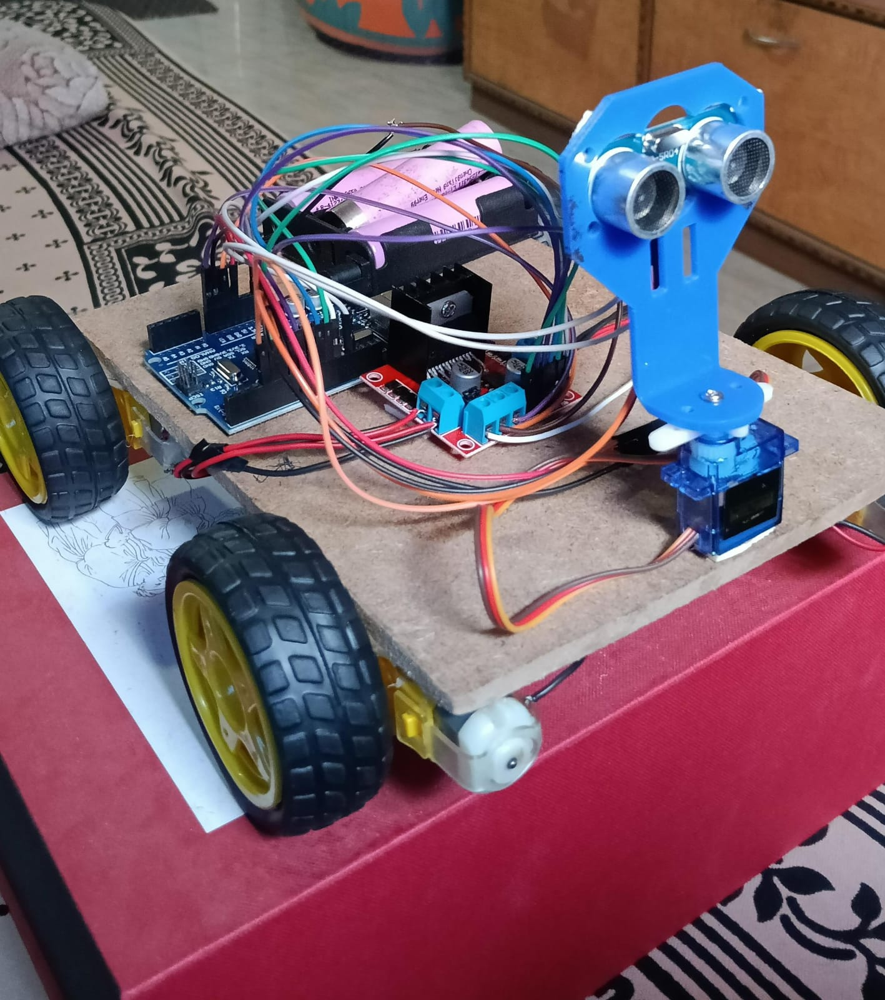
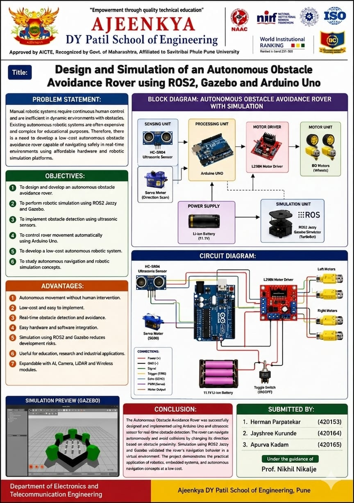
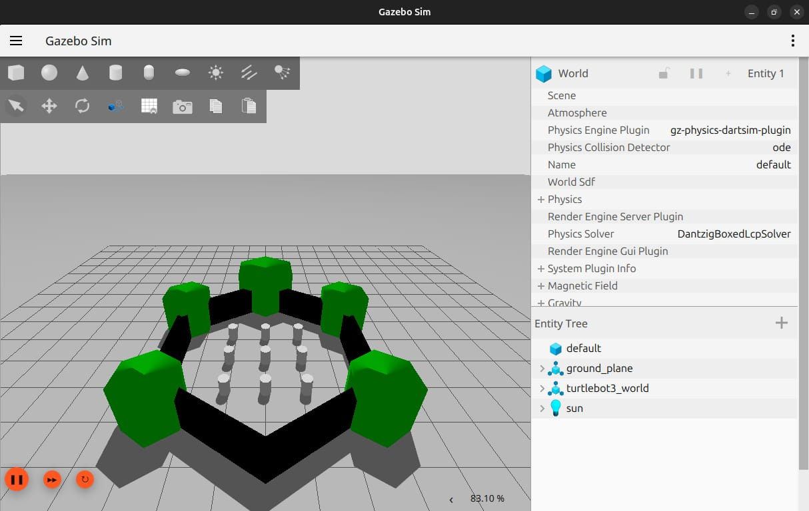
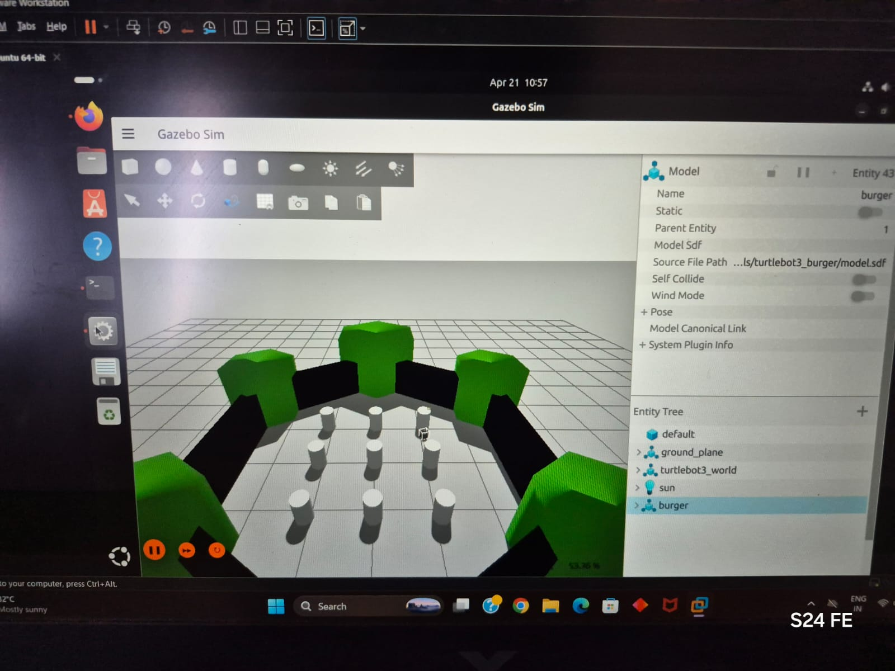
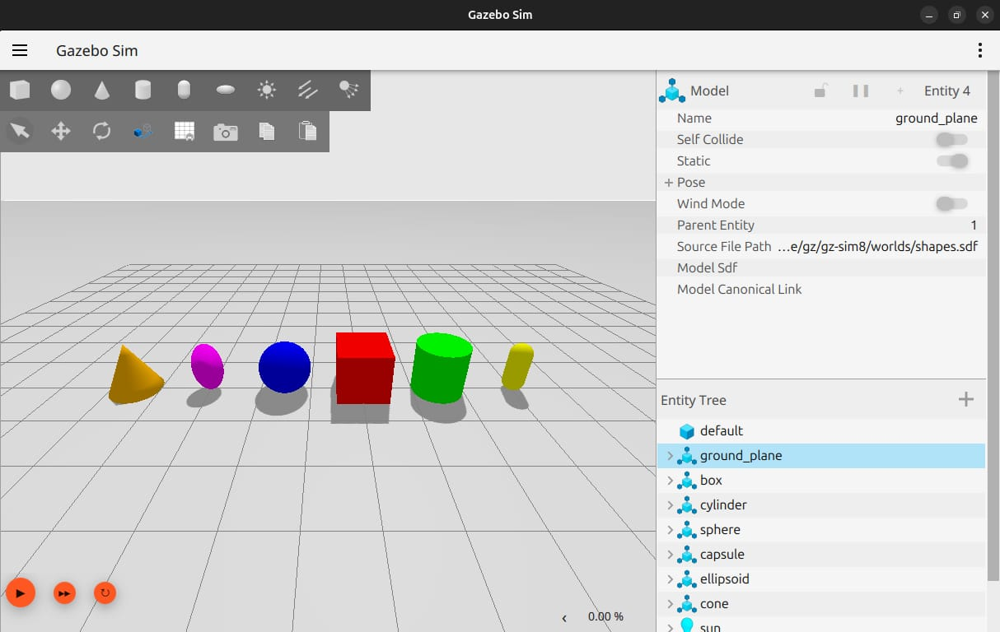
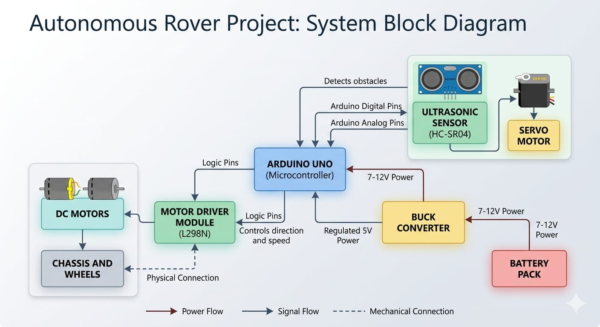

# Autonomous Obstacle Avoidance Rover

A low-cost autonomous mobile rover developed with **Arduino Uno, ultrasonic sensing, servo-based scanning, an L298N motor driver, and four BO geared DC motors**, alongside a **ROS 2 + Gazebo simulation environment** for studying robotic simulation and navigation concepts.


## Project Overview

The project was developed as an engineering robotics prototype with two complementary parts:

- **Physical rover:** embedded obstacle detection and autonomous movement using Arduino.
- **Simulation:** ROS 2 and Gazebo environment for modeling and experimenting with a mobile robot and obstacle course.

The physical and simulated implementations are documented together because they address the same autonomous rover problem, but they are treated as separate control implementations.

## Key Features

### Physical Rover

- Arduino Uno based control
- HC-SR04 ultrasonic obstacle detection
- Servo-mounted directional scanning
- L298N dual H-bridge motor driver
- Four BO geared DC motors
- Battery-powered operation
- Automatic obstacle detection and direction selection
- Low-cost chassis and electronics

### ROS 2 / Gazebo

- ROS 2 Jazzy based simulation work
- Gazebo simulation environment
- Custom/experimental rover model work
- TurtleBot3-based simulation experiments
- Obstacle-course environment
- Exploration of robot motion, sensors, simulation worlds and ROS interfaces

## System Architecture



### Physical control flow

```text
                +-------------------+
                |    Battery Pack   |
                +---------+---------+
                          |
                    +-----v------+
                    | Buck / 5 V |
                    +-----+------+
                          |
                    +-----v------+
                    | Arduino Uno|
                    +--+------+--+
                       |      |
          +------------+      +-------------+
          |                                   |
    +-----v------+                      +-----v------+
    | HC-SR04    |                      | L298N      |
    | + Servo    |                      | Motor      |
    +------------+                      | Driver     |
                                        +-----+------+
                                              |
                                        +-----v------+
                                        | 4x BO      |
                                        | DC Motors  |
                                        +------------+
```

## Obstacle Avoidance Logic



The documented control sequence is:

1. Initialize the controller and sensors.
2. Check the system/battery condition.
3. Measure the distance ahead using the HC-SR04.
4. If no obstacle is within the threshold, continue forward.
5. If an obstacle is detected, rotate the servo to scan alternative directions.
6. Measure available clearance.
7. Select a direction based on the measured distance.
8. Execute the turn.
9. Resume forward movement and repeat the process.

## Simulation



The ROS 2/Gazebo portion of the project was used to investigate robotic simulation and navigation concepts.

Additional simulation captures:







> **Scope note:** The physical rover is Arduino controlled. The repository does not claim that the physical hardware is directly controlled by ROS 2 unless the corresponding verified interface/source is added.

## Hardware

| Component | Purpose |
|---|---|
| Arduino Uno | Embedded controller |
| HC-SR04 | Ultrasonic distance measurement |
| Servo motor | Directional sensor scanning |
| L298N | DC motor driver |
| BO geared motors | Rover drive |
| Li-ion battery pack | Power source |
| Buck converter | Regulated supply |
| Chassis + wheels | Mechanical platform |

See [`hardware/components.md`](hardware/components.md) for additional notes.

## Repository Structure

```text
autonomous-obstacle-avoidance-rover/
├── README.md
├── LICENSE
├── .gitignore
├── arduino/
│   └── README.md
├── ros2/
│   └── README.md
├── hardware/
│   └── components.md
├── simulation/
│   └── README.md
├── docs/
│   ├── architecture.md
│   ├── project-overview.md
│   └── limitations.md
└── media/
    ├── physical-rover.jpg
    ├── autonomous-rover-flowchart.jpg
    ├── system-block-diagram.jpg
    ├── project-poster.jpg
    ├── gazebo-rover.jpg
    ├── gazebo-rover-turtlebot-world.jpg
    ├── gazebo-shapes-world.jpg
    └── gazebo-simulation-overview.jpg
```

## Project Documentation

- [Project Overview](docs/project-overview.md)
- [System Architecture](docs/architecture.md)
- [Scope and Limitations](docs/limitations.md)
- [Hardware](hardware/components.md)
- [ROS 2 Simulation](simulation/README.md)
- [Arduino Firmware](arduino/README.md)

## Project Poster



## Future Development

Potential extensions include:

- ROS 2 hardware integration
- `ros2_control`
- LiDAR integration
- Camera-based perception
- SLAM and localization
- Nav2-based autonomous navigation
- Sensor fusion
- Remote teleoperation
- Microcontroller/ROS 2 serial or micro-ROS interface
- Improved chassis and power management

These are **future extensions**, not claims about the current implementation.

## Academic Context

**Project:** Design and Simulation of an Autonomous Obstacle Avoidance Rover using ROS 2, Gazebo and Arduino Uno

**Department:** Electronics and Telecommunication Engineering

**Institution:** Ajeenkya DY Patil School of Engineering, Pune

## Author

**Herman Parpatekar**

Electronics & Telecommunication Engineering

---

*This repository documents the project as developed and photographed. Source files can be added incrementally from the original development workspace.*
